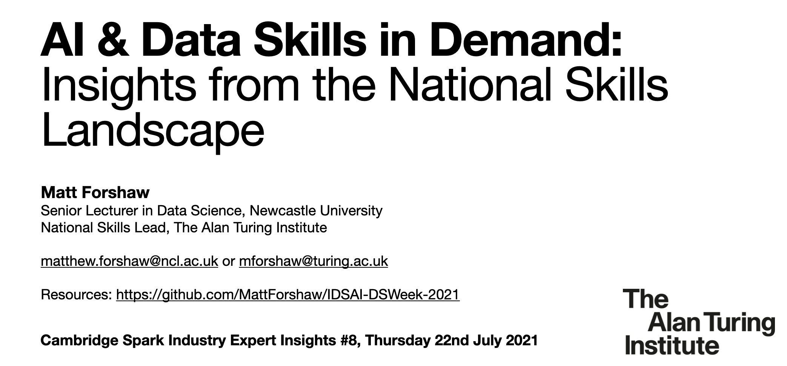

# Cambridge Spark Industry Expert Insights #8 - 22nd July 2021

Slide deck as <a href="CS-IndustryExpertInsights-July2021.pdf">PDF</a>.

## Thank you!
Thank you to Kieran at <a href="https://www.cambridgespark.com/">Cambridge Spark</a> and Huw at <a href="https://bbc.co.uk">BBC</a> for organising the session. It would be fantastic to stay in touch, so please do not hesitate to get in touch with me at the contact details below.

## Resources
- [Turing Interest Groups](https://www.turing.ac.uk/research/interest-groups/)
- [Quantifying the UK Data Skills Gap](https://www.gov.uk/government/publications/quantifying-the-uk-data-skills-gap/quantifying-the-uk-data-skills-gap-full-report)
- [Understanding the UK AI labour market: 2020](https://www.gov.uk/government/publications/understanding-the-uk-ai-labour-market-2020)
- [AI Data Specialist Apprenticeship Standard](https://www.instituteforapprenticeships.org/apprenticeship-standards/artificial-intelligence-(ai)-data-specialist-v1-0)
- [Royal Geographical Society - Data Skills in Geography – Useful Links](https://www.rgs.org/schools/teaching-resources/data-skills-in-geography-%E2%80%93-useful-links/)
- [Scaling Up the Ethical Artificial Intelligence MSc Pipeline](https://www.bcs.org/media/3047/ethical-ai.pdf), BCS (June 2019)
- [The State of Data Science 2020: Moving from hype toward maturity](https://www.anaconda.com/state-of-data-science-2020) Anaconda (2020)
- [Data Skills Taskforce](https://www.dataskillstaskforce.com/) - Self-assessment portal for SMEs

## Questions, comments and suggestions
I would love to hear from you if you have any questions or comments. Please do not hesitate to contact me via email at matthew.forshaw@ncl.ac.uk, mforshaw@turing.ac.uk or on [Twitter](https://twitter.com/mattforshaw).
